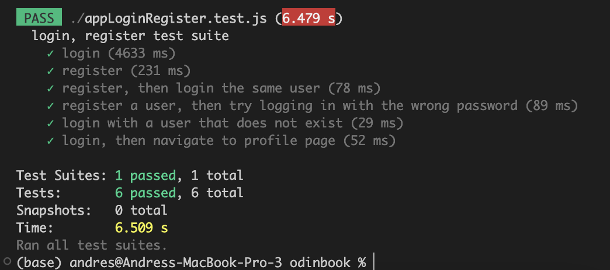

[Live Website](https://odinbook.memberssonly.xyz)

Technologies used: Node.js, Express MongoDB NoSQL Database, JavaScript, HTML and CSS.

I deployed the application using a DigitalOcean droplet.

### Features:

-   Username/password login
-   Facebook login
-   Guest login
-   Register with login/password
-   Add a friend
-   Create a post
-   Comment on a post
-   Like count on posts
-   Profile photo upload
-   Darkmode toggle
-   Like a post

### Node.js routes

<table>
  <tr>
    <th>Method</th>
    <th>Route</th>
    <th>Description</th>
  </tr>
  <tr>
    <td>GET</td>
    <td>/auth/facebook</td>
    <td>attempt to login using Facebook</td>
  </tr>
  <tr>
    <td>GET</td>
    <td>/auth/facebook/callback</td>
    <td>redirects the user after a Facebook login attempt</td>
  </tr>
  <tr>
    <td>POST</td>
    <td>/comment/delete</td>
    <td>deletes a comment</td>
  </tr>
  <tr>
    <td>POST</td>
    <td>/comment/create</td>
    <td>creates a new comment</td>
  </tr>

  <tr>
    <td>POST</td>
    <td>/image</td>
    <td>uploads a users profile image to the Node.js server</td>
  </tr>

  <tr>
    <td>GET</td>
    <td>/profile</td>
    <td>get the users profile page</td>
  </tr>

  <tr>
    <td>GET</td>
    <td>/home</td>
    <td>get the homepage</td>
  </tr>

  <tr>
    <td>POST</td>
    <td>/log-in</td>
    <td>attempt to login using email/password</td>
  </tr>

  <tr>
    <td>GET</td>
    <td>/log-out</td>
    <td>logs the user out</td>
  </tr>

  <tr>
    <td>POST</td>
    <td>/register</td>
    <td>registers a new user</td>
  </tr>

  <tr>
    <td>GET</td>
    <td>/register</td>
    <td>renders the register page with register form</td>
  </tr>

  <tr>
    <td>GET</td>
    <td>/</td>
    <td>renders the homepage</td>
  </tr>

  <tr>
    <td>GET</td>
    <td>/posts/:id</td>
    <td>retrieve a post with a specific ID</td>
  </tr>

  <tr>
    <td>POST</td>
    <td>/posts/new</td>
    <td>create a new post</td>
  </tr>

  <tr>
    <td>POST</td>
    <td>/posts/like</td>
    <td>like a post</td>
  </tr>

  <tr>
    <td>POST</td>
    <td>/posts/delete</td>
    <td>used to delete a post</td>
  </tr>

  <tr>
    <td>POST</td>
    <td>/users/follow</td>
    <td>follow a certain user</td>
  </tr>

  <tr>
    <td>POST</td>
    <td>users/toggle-dark-mode</td>
    <td>toggle dark mode on/off</td>
  </tr>

  <tr>
    <td>GET</td>
    <td>users/find-friends</td>
    <td>get a list of the current user's friends</td>
  </tr>

  <tr>
    <td>GET</td>
    <td>/users/:id</td>
    <td>renders a page which contains a users info</td>
  </tr>

  <tr>
    <td>POST</td>
    <td>/users/unfollow</td>
    <td>unfriends a user</td>
  </tr>
</table>

### MongoDB Database Organization

-   There are three main database models: User, Post, and Comment.

### Website screenshots

### Dark mode

### Testing suite

